This is a repository for the [Diving into the Digital Public Space](https://courses.ceu.edu/courses/2022-2023/diving-digital-public-space-individual-behavioral-digital-traces-collective-social) course (SciencesPo - CEU 2022/23). 

----

# Online Communication Surrounding Terrorist Attacks in France: A Comparative Analysis

*By Juan Arias Arango, Giacomo Da Ros, Timur Naushirvanov & Ludovica Pavoni*

## Table of contents
- [Introduction](#introduction)
- [Research topic](#research-topic)
- [Context](#context)
- [Academic Background](#academic-background)
- [Data & Methodology](#data-&-methodology)
- [Results](#results)
- [Conclusion](#conclusion)
- [Limitations](#limitations)
- [Annex](#annex)
- [Google Colab Notebook](#google-notebook)
- [References](#references)

## Introduction

In recent years, France has experienced a number of high-profile terrorist attacks, according to data from the Global Terrorism Database, between 1970 and 2020, there have been a total of 1228 terrorist attacks, resulting in over 1400 deaths and more than 4000 injuries. The deadliest attack in recent history occurred in November 2015, when a series of coordinated attacks by ISIS militants in Paris left 130 people dead and hundreds more injured (Abboud, 2022). Since then, France has experienced several other high-profile terrorist attacks, including the truck attack in Nice in July 2016, in which 86 people were killed and more than 400 injured (Rubin and Breeden, 2017), and the beheading of a schoolteacher in a Paris suburb in October 2020. The frequency and severity of these attacks have had a significant impact on French society. Additionally, they have led to increased scrutiny of online discourse related to extremism and terrorism, and have also sparked heated debates about immigration, national security, and the role of Islam in French society.
 
The relevance of these attacks for online discourse is increasingly important and lies in the fact that social media platforms, such as Twitter, have effectively become an arena for public discussion and debate. In the aftermath of terrorist attacks, social media can serve as a platform for people to express their opinions, share information, and engage in discussions with others. This can include expressions of support for victims, condemnation of the attackers, and debates about issues related to the attacks, such as immigration, religion, and national security.
 
Analyzing online communication related to terrorist attacks in France can therefore provide valuable insights into the nature and extent of extremist sentiment and activity online, as well as the ways in which information is disseminated, before and after the attacks. By examining the language and themes used in online discourse, we can gain a better understanding of how people make sense of these events and the impact they have on French society. Understanding the nature and extent of this online discourse is therefore crucial for gaining insights into the dynamics of extremism, polarization, and political debate in France.

## Research topic

Our research objective is to analyze online communication related to four chosen attacks in France. 

In particular, we set out to examine how online content – Twitter social media posts – related to the aforementioned attacks changes over time. To better understand how communication changes we set out to analyze tweets relating to both attacks carried out by right-wing extremists and Islamist extremists.

By analyzing online communication related to these attacks, we can gain insight into the nature and extent of extremist sentiment and activity online, as well as the ways in which information is disseminated before and after the attacks. We aim to identify patterns, themes, and sentiment in the online content through natural language processing, machine learning, and topic modeling. Additionally, the study also seeks to examine how the online discourse changed before and after the attacks and to examine whether partisanship or ideology differentiate the attacks if they allow for greater discourse change or discourse polarization.

## Context

The two right-wing extremist attacks under consideration are the Bayonne mosque shooting that took place on October 28th, 2019, and the 2022 Paris attack that occurred on December 23rd, 2022. The Bayonne mosque shooting was carried out by an 84-year-old retired French army officer who attempted to set fire to the mosque before shooting and injuring two men who tried to stop him. The attacker, who had a history of far-right views, was later arrested and charged with attempted murder, possession of weapons, and attempted arson (Chazan, 2019). The 2022 Paris attack was perpetrated by an individual believed to have links to far-right groups, who opened fire in a crowded shopping center, resulting in the deaths of six people, including three Kurds, and injuring several others. The perpetrator, who was identified as a 34-year-old French national, was later found dead at the scene (Henley, 2022).
 
The attacks claimed by the Islamic State that were selected for this study are the Nice stabbing that occurred on October 29th, 2020 and the Rambouillet attack that took place on April 23rd, 2021. The Nice stabbing was carried out by a Tunisian man who stabbed several people with a knife inside the Notre-Dame Basilica, resulting in the deaths of three people and several others being injured. The attacker, who had arrived in France a few weeks earlier, was arrested and charged with murder and attempted murder (Salaün and Pailliez, 2020). The Rambouillet attack was carried out by a Tunisian man who stabbed and killed a police officer in the entrance hall of a police station. The attacker, who had a history of psychiatric problems, was later shot dead by other police officers. The Islamic State claimed responsibility for the attack, stating that the attacker was acting on their behalf (Breeden, 2021).

## Academic Background

The utilization of social media in the context of terrorist attacks has been explored through various themes in existing literature. Collective sense-making, as discussed in studies by Stieglitz et al. (2017), Heverin and Zach (2012), Mirbabaie and Zapatka (2017), and Fischer et al. (2016), focuses on the use of social media to make sense of events during and after a crisis, aiding individuals and communities in understanding and coping with the situation. Convergence behavior, a theme found in papers by Mirbabaie et al. (2017), Shaw et al. (2013), and Hughes et al. (2008), examines how individuals and groups come together on social media to share information, support each other, and coordinate response efforts during crisis situations.

Information dissemination and gathering play a crucial role in the spread of information during a crisis, as evidenced in the works of Akhgar et al. (2013), Simon et al. (2015), and Eriksson (2016). These studies highlight the sharing of eyewitness accounts, official updates, and news articles on social media platforms. Emotional support and expressions of grief, as explored in Stieglitz et al. (2017), Heverin and Zach (2012), and Eriksson (2016), discuss how social media is used for emotional exchanges, including sharing grief, shock, and solidarity during and after a crisis event.

The role of influential users in shaping the discourse and spreading information during crisis situations has been investigated by Mirbabaie et al. (2017) and Mirbabaie and Zapatka (2017). Having identified these main themes, our study seeks to build upon them by examining the dynamics of online communication surrounding terrorist attacks in France. In particular, we are interested in how discourse changes over time through the identification of patterns, themes, and sentiment in the content.

## Data & Methodology

In our study, we employed a tweet scraping methodology [^1] to collect relevant data on Twitter. Specifically, we focused on tweets written in French, as the attacks under examination occurred in France, and we aimed to obtain a representative sample of the French population's attitudes toward the events.

[^1]:  This was possible thanks to automated scripts provided by Alessandro Galeazzi.

We restricted our corpus by using specific keywords, including terms such as 'migration,' 'migrant,' 'immigré,' and 'refugié[^2]. The time frame for our data collection spanned seven days before and seven days after the attacks, which we believe provided an appropriate window to observe any significant shifts or changes in the online discourse related to the selected attacks. Our initial corpus comprised almost half a million tweets, which we subsequently cleaned, resulting in a final dataset of 118 576 tweets.

[^2]: Please see the Google Colab linked for the entire list of keywords used.

Our study utilized a variety of analytical methods to gain insights into the online discourse related to the selected attacks and to address our research questions. To determine the main sentiments associated with the attacks, we employed two dictionary-based methods, VADER and TextBlob, which provided a holistic view of the sentiment of each tweet in our dataset. Furthermore, we employed TFCamembertForSequenceClassification, an embedding-based method for French sentiment analysis, to ensure accuracy and language specificity. The same methodology was applied to identify the ideology of the tweets and to trace changes before and after the attacks. We then also used word clouds to have readily understandable graphs showing for both sentiments and ideology. Furthermore, to conduct our analysis, we manually annotated a dataset of more than 1400 tweets to classify them based on their sentiment and partisanship[^3]. The tweets were categorized as either “negative”, “neutral”, or “positive” in terms of sentiment and as “left”, “neutral”, or “right” in terms of partisanship. To ensure the accuracy of the annotation process, all the members of our group were involved, and disagreements were resolved through discussion and consensus. Once the dataset was fully annotated, we created separate copies of the dataset for each sentiment and partisanship category, including only positive tweets, negative tweets, and tweets labeled as being from the left or right. These copies of the dataset allowed us to analyze and compare the sentiment and partisanship of tweets separately, providing a more nuanced understanding of how these factors impact public discourse on social media.

[^3]: For more details on how the classification was carried out please refer to the Annex.

Our study utilized a variety of analytical methods to gain insights into the online discourse related to the selected attacks and to address our research questions. To determine the main sentiments associated with the attacks, we employed two dictionary-based methods, VADER and TextBlob, which provided a holistic view of the sentiment of each tweet in our dataset. Furthermore, we employed TFCamembertForSequenceClassification, an embedding-based method for French sentiment analysis, to ensure accuracy and language specificity. The same methodology was applied to identify the ideology of the tweets and to trace changes before and after the attacks. We then also used word clouds to have readily understandable graphs showing for both sentiments and ideology. Furthermore, to conduct our analysis, we manually annotated a dataset of more than 1400 tweets to classify them based on their sentiment and partisanship[^3]. The tweets were categorized as either “negative”, “neutral”, or “positive” in terms of sentiment and as “left”, “neutral”, or “right” in terms of partisanship. To ensure the accuracy of the annotation process, all the members of our group were involved, and disagreements were resolved through discussion and consensus. Once the dataset was fully annotated, we created separate copies of the dataset for each sentiment and partisanship category, including only positive tweets, negative tweets, and tweets labeled as being from the left or right. These copies of the dataset allowed us to analyze and compare the sentiment and partisanship of tweets separately, providing a more nuanced understanding of how these factors impact public discourse on social media

To uncover the most prevalent themes and discussions surrounding the attacks, we employed Bertopic, a topic modeling tool. Our use of these diverse analytical methods enabled us to obtain a comprehensive understanding of the online discourse surrounding the selected attacks. 

Finally, to address our third research question, which examined how the use of hashtags changed before and after the events, we plotted networks of hashtags by degree. This enabled us to identify the most frequently used and influential hashtags within the online discourse. Overall, our use of these varied analytical methods allowed us to gain a nuanced and comprehensive view of the online communication related to the selected attacks.

## Results

### Sentiment Analysis

#### Tweets' Sentiments

To understand which are the sentiments associated with attacks, we carried out sentiment analysis with three different methods in order to categorize the emotions related to the tweets. For instance, we identified tweets as positive or negative when two out of the three employed methods classified the tweet as positive or negative. Let us then take a look at our main findings, starting with Figure 1. 

Image 1: Ratio of negative sentiments for assaults

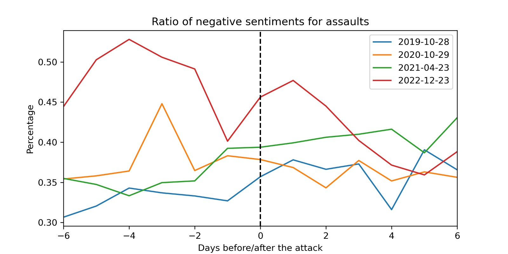

We observed that the ratio of negative sentiments for assaults experienced a slight rise after the attacks. This increase was particularly noticeable on the day following the attacks, with the exception of the event from 2020. However, there does not appear to be a clear trend in the days that followed. The data also seems to indicate that the proportion of positive sentiments declined in the aftermath of the attacks. As depicted in the graph below, within 2 to 6 days, the ratio of positive tweets dropped from an average of 0.38 to 0.34.

The case of the 2022 attack seems to present the clearest picture, depicting an increase in the proportion of positive tweets following the incident. We attribute this to the significant expression of support from the Kurdish community towards the victims of the attack. Additionally, the French authorities did not immediately classify the attack as "terrorist", which led to a surge in tweets supporting the Kurdish community.

Image 2: Ratio of positive sentiments for assaults

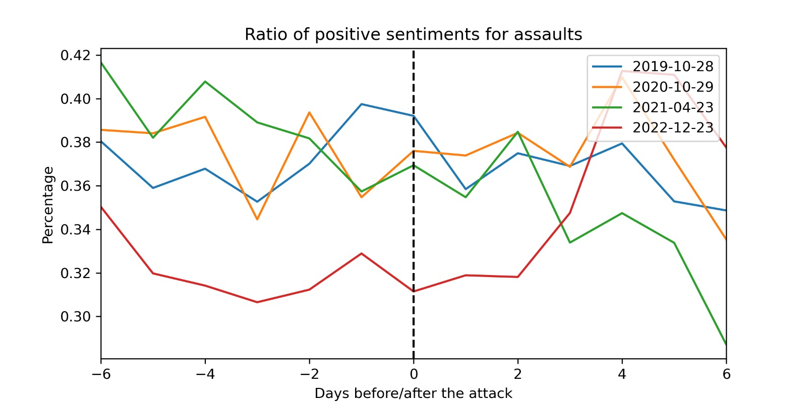

We then proceeded by investigating the words that appeared most frequently in the tweets identified as either positive or negative. As evidenced by Image 3, the most frequent words in negative tweets are _‘raciste’, ‘ennemi’, ‘extreme’, and ‘anti’_. It is also interesting to note that the word ‘droite’ is employed rather frequently in negative tweets. On the other hand, we can observe that the words most frequently appearing in positive tweets are _‘aime’, ‘paix’, ‘libre’, and ‘bonne’_. Also, in this case it was quite interesting to note that the word _‘prophete’_ appears among the most frequent.

Image 3: Differences in word frequency in positive and negative tweets

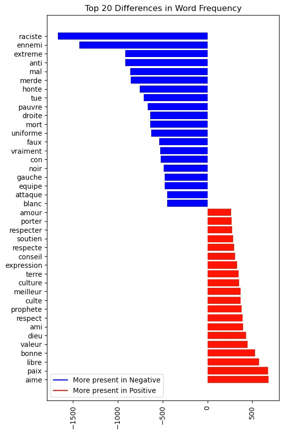

#### Tweets' Ideology/Politicization

To analyze the impact of terrorist attacks on tweets labeled as "ideological” or “politicized” (tweets annotated either as "left" or "right"), we followed the same methodology presented above. As the term “ideology” was employed in the labeling of the two sets, we will henceforth adhere to this denomination. We then generated word clouds for both ideological and non-ideological tweets to identify the main topics that characterized them. The results, presented below, clearly show that ideological tweets make significantly more references to topics related to religion, migration, and politics ("islamiste", "chretien", "raciste", "accueil", "etranger").

For non-ideological tweets, we observed that the main topics were related to the event itself and not religious topics. Here, we noticed that the tweets were mentioning the victims, the atrocity of the event, and how the government managed the crisis. For instance, as shown in the word cloud, the main topics identified in the dataset of non-ideological tweets were: "politique", "president", "etat", "attaque", "mort", "victime", etc. This can intuitively be associated with the information-sharing practices mentioned in the literature.

Image 4: Word Clouds

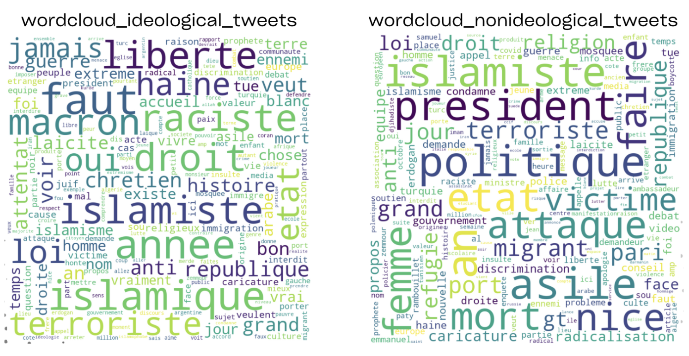

As done for the sentiment of the tweets we also investigated the most frequently used, thus the most frequently recurring, words in ideological and non-ideological tweets. As evidenced by Figure 5, notable differences exist between the two types of tweets. The graph clearly demonstrates this imbalance in word distribution. Non-ideological tweets do not seem to present words around which discourse is organized. On the other hand, ideological ones are strikingly polarized in this sense. The words appearing most frequently in ideological tweets are _‘probleme’, ‘faut’, ‘liberte’, ‘raciste’, ‘chretien’, ‘droit’_. This corroborates the findings obtained through the word clouds: ideological tweets are more related to religion, migration, and politics.

Image 5: Differences in word frequency in ideological and non-ideological tweets

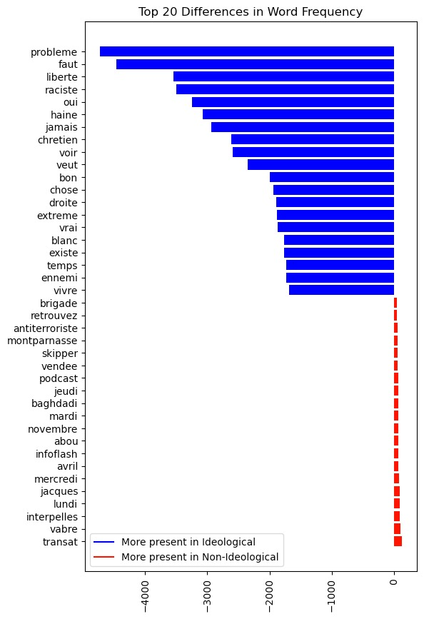

### Bert Topic Modeling

On pre-processed text data, we additionally applied the BERT algorithm to identify the main topics that were discussed before and after the attacks. As the heatmap on Image 6 shows, the algorithm identified around 500 topics, with the majority of them being related to the 2020 Nice attack. A closer look at the first 100 topics reveals that some of the identified topics span across all attacks, while others are specific to certain events.

Image 6: Heatmap of BERT topics over time

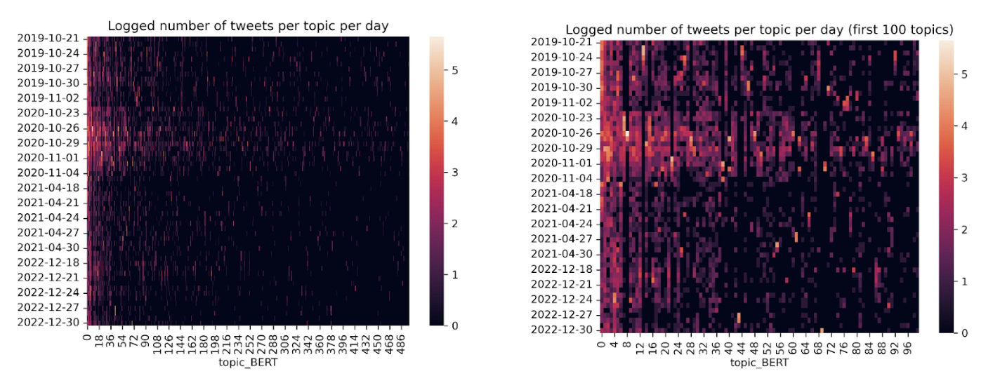

### Hashtags networks

To then answer our third research question we focused on hashtag network in order to gain a deeper understanding of the relationship between hashtags, based on their co-occurrence in social media posts; indeed, by analyzing the frequency and patterns of hashtag co-occurrence, we were able to identify clusters of related hashtags, as well as the central or most influential hashtags within those clusters. Image 7 reports our most interesting finding, related to the Bayonne mosque shooting. In the seven days leading up to the attack, the most used hashtags are #france, #islam, #islamophobia, #immigration, #racism, #terrorism, and #macron and they all are equidistant, or, better, they follow a rather normal pattern. Not surprisingly, the day of the attack new hashtags emerge and the overall shape of the network reports numerous changes: new nodes emerge. Different strands emerge: one reports an increase in the use of anti-Muslim hashtags (see #trump, #zemmour) and another that links back to similar events that took place in Germany. What is most interesting, however, is the evolution of the hashtag networks in the seven days following the attack: there appears to be a new re-centralization of the hashtags and an intensification of connections between hashtags that express support for Muslim victims (#freresmusulmans). 

Image 7: Bayonne mosque shooting hashtags' network effect

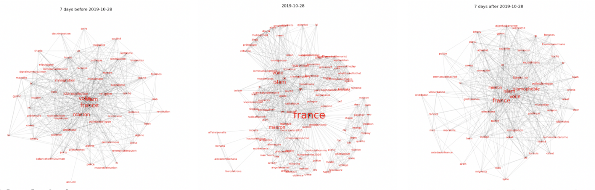

To further analyze hashtags’ use and its importance in relation to terrorist attacks we have also taken into account the Nice stabbing by reporting the changes in hashtags before and after the event in terms of their different centralities. With regards to degree centrality we can observe that the most central tweets, both before and after the attack, remain the same, with the most prominent being #france, #islam, #macron, #terrorism, #islamophobie. Only in this event we observe #darmanin which is in line with France’s political discourse around the time of the attack. The tweets that rose in the following days are unsurprisingly #nice, #attentat and also #immigration, #terrorismeislamiste, thus confirming the idea that folllowing an Islam-revendicated attack online discourse intensifies around the hot topics of immigration and terrorism.

Image 8: Nice stabbing changes in hashtags

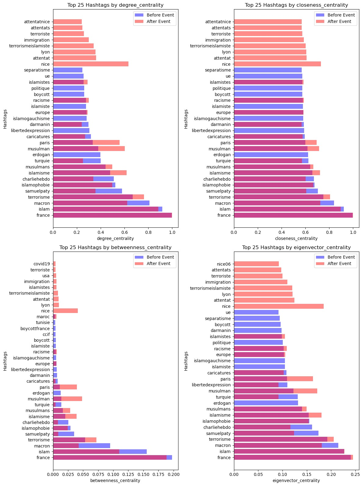

## Conclusion

Our study aimed to examine how online communication on Twitter changes in response to terrorist attacks in France and how messaging attributes, sentiment, and partisanship may impact our interpretation of public sentiment and behavior. Our study was structured around three main research questions, each investigating a different aspect of the online discourse around the four terrorist attacks we selected.
Our first research question revolved around the analysis of the main sentiments associated with the attacks and whether these sentiments recorded a significant shift before and after the event. Our second research question instead revolved around the analysis of the ideology behind the selected tweets and whether significant changes were observable. Moreover, we were interested in finding out whether a change could be observed before and after the attacks and whether right-wing and Islam-revendicated attacks presented differences in online discourse. Our analysis revealed that, on the one hand, tweets from the 2022 Paris attack were more ideological and presented stronger negative sentiment than tweets related to other attacks. This finding suggests that significant events may amplify pre-existing ideological differences and lead to more negative sentiment on social media. On the other hand, for the remaining attacks we did not find conclusive changes before and after the events in terms of sentiments and partisanship. This suggests that the impact of such events on public discourse may vary depending on the nature of the event and other contextual factors.
Our third research question set out to map hashtags’ use before and after the selected events to, once again, detect changes in the online discourse. This is, arguably, where our methodology performed at its best. Through hashtag analysis we were able to clearly observe a shift in themes and topics in all the selected attacks. The most interesting results were recorded for the Bayonne mosque shooting, where seven days before the attack the most used hashtags revolved around islamophobia, immigration, and racism while in the following seven days sentiments of community, kinship, and brotherhood with the Muslim community.
What might also be considered an interesting finding is the sometimes challenging process of making sense of sentiment analysis results. These were not as clear as we had hoped in designing our methodology. As previously noted, the most interesting results pertain to hashtag networks and topic modeling. Methodological considerations should then be of prime importance in future research efforts.

## Limitations

Our research on online communication related to attacks carried out by right-wing extremists and Islamist extremists has several potential limitations. These include the limited number of attacks investigated, personal bias in annotation, and the absence of additional document types - such as newspaper articles.
In addition to these limitations, there are several other potential challenges to the study's design and implementation. These include language barriers, selection bias, and ethical considerations.
Language barriers may limit the diversity of perspectives and experiences represented in the data collected, as the study is focused on social media posts in French. Similarly, selection bias may limit the generalizability of the findings to individuals who do not use social media or who do not share their thoughts on social media.

To mitigate these limitations, further research will need to employ more rigorous data collection and analysis methods, including the use of multiple annotators and a systematic process for data collection. Furthermore, additional document sources - such as newspaper articles - would prove useful.

## Annex

To understand the ideology behind the tweets and their evolution over time, we manually annotated a sample of 1400 tweets to train our dataset attributing each tweet as being either “right”, “left”, or “neutral” and attributing to each tweet its sentiment “positive”, “negative”, or “neutral”. 

What follows are examples of how we categorized the tweets. For instance, neutral tweets, both in ideology and sentiment, were mainly tweets by media outlets which are strictly factual tweets, providing information without having or suggesting a specific ideology or sentiment, as evidenced below in Image 9.

Image 9: Neutral tweet

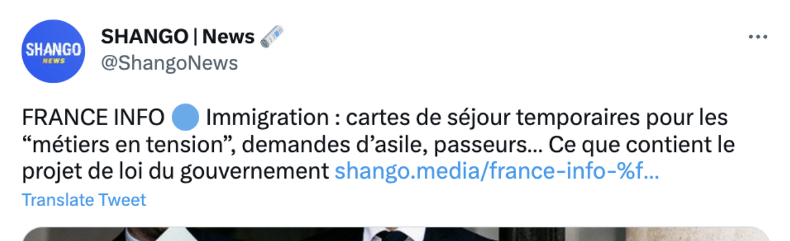

On the other hand, tweets we identified as “right” and “negative” tended to look like the one below. It is clearly understandable that the tweet is first of all right-wing and second of all it is readily obvious the negative sentiment towards Islam and muslims.

Image 10: Right and negative tweet

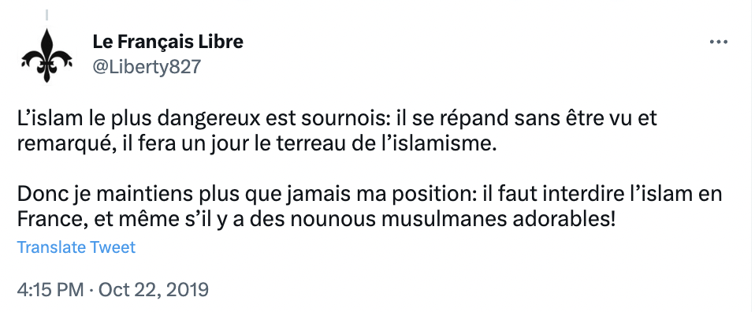

Tweets that we identified as “left” and “positive” were those tweets who shared positive ideas and presented constructive, forward-looking, and progressive ideas.

Image 11: Left and positive tweet

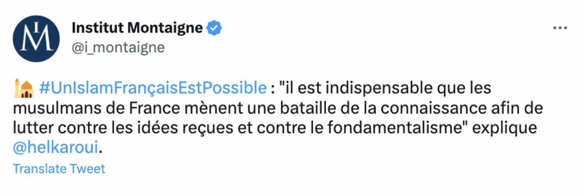

Tweets that we identified as “left” and “negative” tended to present leftist ideas while at the same time writing about terrorism, war, deaths.

Image 12: Left and negative tweet

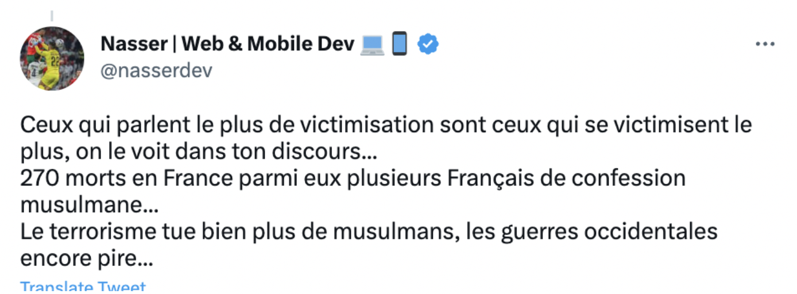

## Google Colab Notebook
https://colab.research.google.com/drive/1EHzsCu0G9TZafKcUvGwRVht7whme9q2L#scrollTo=u4p2A8O87xpN

## References
**Peer Reviewed and Academic Articles**

Akhgar, B., Fortune, D., Hayes, R. E., Guerra, B., & Manso, M. (2013). Social media in crisis events: Open networks and collaboration supporting disaster response and recovery. _2013 IEEE International Conference on Technologies for Homeland Security (HST)_, 760–765.

Bird, D., Ling, M., & Haynes, K. (2012). Flooding Facebook-the use of social media during the Queensland and Victorian floods. _Australian Journal of Emergency Management, The, 27_(1), 27–33.

Eriksson, M. (2016). Managing collective trauma on social media: The role of Twitter after the 2011 Norway attacks. _Media, Culture & Society, 38_(3), 365–380.

Fischer, D., Eismann, K., & Fischbach, K. (2016). _Usage behavior of social network sites in the aftermath of terrorist attacks_.

Fischer-Preßler, D., Schwemmer, C., & Fischbach, K. (2019). Collective sense-making in times of crisis: Connecting terror management theory with Twitter user reactions to the Berlin terrorist attack. :Computers in Human Behavior, 100_, 138–151.

Heverin, T., & Zach, L. (2012). Use of microblogging for collective sense-making during violent crises: A study of three campus shootings. _Journal of the American Society for Information Science and Technology, 63_(1), 34–47.

Mirbabaie, M., Bunker, D., Deubel, A., & Stieglitz, S. (2019). Examining convergence behaviour during crisis situations in social media-a case study on the manchester bombing 2017. _Smart Working, Living and Organising: IFIP WG 8.6 International Conference on Transfer and Diffusion of IT, TDIT 2018, Portsmouth, UK, June 25, 2018, Proceedings, 60–75_.

Mirbabaie, M., & Zapatka, E. (2017). _Sensemaking in social media crisis communication–A case study on the Brussels bombings in 2016_.

Shaw, F., Burgess, J., Crawford, K., & Bruns, A. (2013). Sharing news, making sense, saying thanks: Patterns of talk on Twitter during the Queensland floods. _Australian Journal of Communication, 40_(1), 23–39.

Simon, T., Goldberg, A., & Adini, B. (2015). Socializing in emergencies—A review of the use of social media in emergency situations. _International Journal of Information Management, 35_(5), 609–619.

Stieglitz, S., Bunker, D., Mirbabaie, M., & Ehnis, C. (2018). Sense-making in social media during extreme events. _Journal of Contingencies and Crisis Management, 26_(1), 4–15.

**Press Articles**

Abboud, L. (2022, June 29). Terrorists behind 2015 Bataclan attack sentenced to life by Paris court. _Financial Times_. https://www.ft.com/content/6ac6e6a5-8c39-43b8-95aa-ab0c7df54240

Breeden, A. (2021, 23 April). France opens terrorism inquiry after killing at Police station. _New York Times_. https://www.nytimes.com/2021/04/23/world/europe/france-terrorism-police-station.html

Chazan, D. (2019, 28 October). France mosque shooting: Man in his 80s arrested after two shot in Bayonne. _The Telegraph_. https://www.telegraph.co.uk/news/2019/10/28/france-mosque-shooting-man-arrested-two-shot-bayonne/

Henley, J. (2022, 23 December). Clashes in Paris after three people killed in shooting at Kurdish center. _The Guardian_. https://www.theguardian.com/world/2022/dec/23/dead-injured-paris-shooting-reports

Rubin, J. A., & Breeden, A. (2017, July 14). France Remembers the Nice Attack: ‘We Will Never Find the Words’. _New York Times_. https://www.nytimes.com/2017/07/14/world/europe/nice-attack-france-bastille-day.html

Salaün, T., & Pailliez, C. (2020, 30 October). France tightens security after Nice attack, protests flare in part of Muslim world. _Reuters_ https://www.reuters.com/article/france-security-idUSKBN27F1AI

**General Information**

"France". _Global Terrorism Database_. https://www.start.umd.edu/gtd/search/Results.aspx?charttype=pie&chart=target&casualties_type=&casualties_max=&country=69
